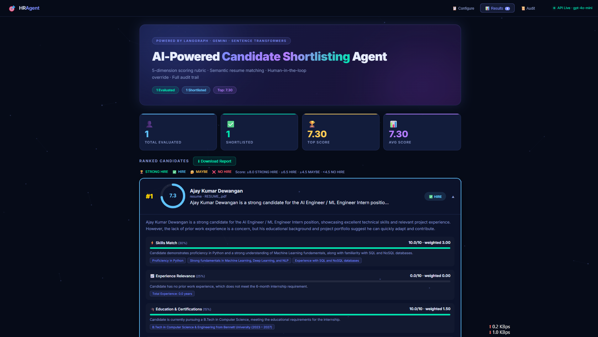
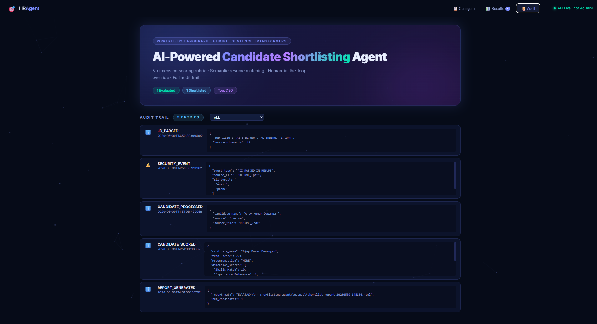
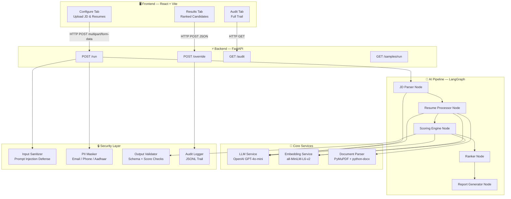
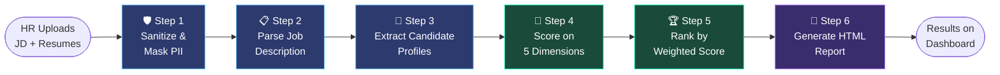
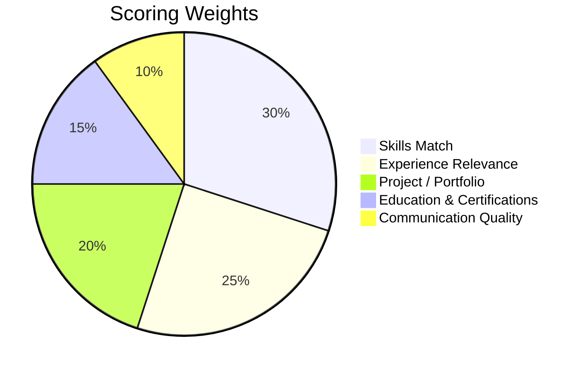
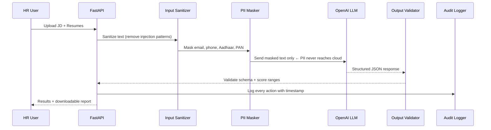
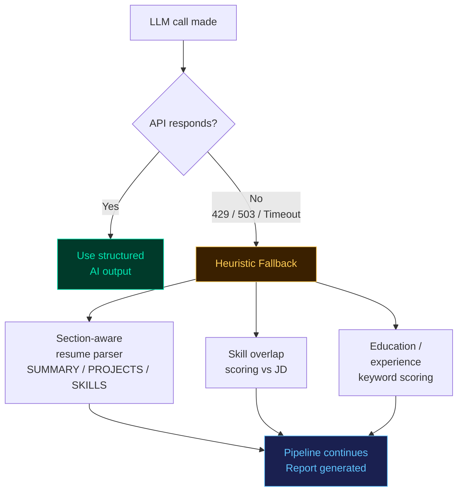

<div align="center">

# 🎯 HR Shortlisting Agent

### AI-Powered Candidate Evaluation Platform

*Automate the resume screening workflow with transparent AI scoring, semantic matching, and a human-in-the-loop override system*

[](https://python.org)
[](https://fastapi.tiangolo.com)
[](https://react.dev)
[](https://langchain-ai.github.io/langgraph/)
[](https://openai.com)
[](LICENSE)

</div>

---

## 📌 The Problem

HR teams screen **hundreds of resumes per role** manually. This is:

| Problem | Impact |
|---|---|
| ⏱️ Slow | 5–7 minutes per resume, days per batch |
| ⚖️ Inconsistent | Different reviewers apply different standards |
| 🧠 Cognitively draining | Quality drops after the 20th resume |
| 📋 Not auditable | Hard to justify why a candidate was rejected |

**This project solves all four** — using AI to do the heavy lifting while keeping the human HR team in control.

---

## ✅ What It Does (Simple Explanation)

> Think of this as a smart **AI recruiter assistant** sitting between your job posting and your interview shortlist.

```
You upload:  JD text / PDF / DOCX   +   Resumes / LinkedIn JSONs
                        ↓
AI does:     Read → Extract → Score → Rank → Report
                        ↓
You get:     Ranked candidates with scores, evidence, and a downloadable report
             (you can override any score with a reason before finalising)
```

---

## 🖥️ Screenshots

### Results Dashboard — Ranked Candidates with AI Scores



### Audit Trail — Complete Transparency of Every Action



---

## 🏗️ System Architecture

The platform is built in three clean layers that communicate via well-defined interfaces.



---

## 🔄 How the AI Pipeline Works (Step by Step)

Each step is a **LangGraph node** — a discrete, testable unit with its own input/output contract.



### What happens inside each step

| Step | What the AI does | Fallback if LLM fails |
|---|---|---|
| **1 — Sanitize** | Strip prompt injection attempts, mask email/phone | Always runs (no LLM needed) |
| **2 — Parse JD** | Extract required skills, experience, education from the job description | Rule-based keyword extraction |
| **3 — Extract Profiles** | Section-aware parsing: SUMMARY, PROJECTS, EDUCATION, SKILLS | Heuristic section splitter + regex |
| **4 — Score** | Evaluate candidate against JD on 5 rubric dimensions with evidence | Deterministic overlap scoring |
| **5 — Rank** | Sort all candidates by total weighted score | Pure Python sort, no LLM |
| **6 — Report** | Render professional HTML shortlist report via Jinja2 | Always runs (no LLM needed) |

---

## 📊 Scoring Rubric — The 5 Dimensions

Every candidate receives a score on each dimension, plus a one-line justification and matched evidence.



| Dimension | Weight | Poor (0–4) | Average (5–7) | Excellent (8–10) |
|---|---|---|---|---|
| **Skills Match** | 30% | < 30% skills match | 50–70% match | > 85% match |
| **Experience Relevance** | 25% | Completely unrelated domain | Adjacent domain | Exact domain + seniority |
| **Project / Portfolio** | 20% | No projects | 1–2 generic projects | Strong, relevant portfolio |
| **Education & Certs** | 15% | Below requirements | Meets minimum | Exceeds + extra certs |
| **Communication Quality** | 10% | Poor structure / grammar | Adequate clarity | Crisp, impactful, well-structured |

### Hiring Decision Thresholds

```
Score ≥ 8.0  →  ✅ STRONG HIRE
Score ≥ 6.5  →  👍 HIRE
Score ≥ 4.5  →  🤔 MAYBE  (Human Review Recommended)
Score < 4.5  →  ❌ NO HIRE
```

---

## 🔒 Security Architecture

Security is built into every layer — not bolted on at the end.



### Six Security Controls

| Control | File | What it prevents |
|---|---|---|
| Prompt Injection Defense | `security/input_sanitizer.py` | Malicious resume text hijacking the LLM |
| PII Masking | `core/pii_masker.py` | Personal data reaching cloud APIs |
| Schema Validation | `security/output_validator.py` | Hallucinated or malformed LLM output |
| Score Auto-correction | `security/output_validator.py` | Wrong weighted scores or inconsistent recommendations |
| File Type + Size Guard | `api_server.py` | Malicious file uploads, DoS via large files |
| Audit Trail | `security/audit_logger.py` | Non-repudiation of all hiring decisions |

---

## 🛡️ Resilience — What Happens When OpenAI Is Down

The system **never crashes** due to an LLM failure. It falls back automatically:



> Recruiters see a **warning banner** in the UI indicating fallback mode was used — full transparency, zero outage.

---

## 🧰 Tech Stack

| Layer | Technology | Why This Choice |
|---|---|---|
| **Frontend** | React 18 + Vite | Fast dev server, component reusability, HMR |
| **Backend** | FastAPI | Async Python, automatic OpenAPI docs, typed responses |
| **AI Workflow** | LangGraph | State-machine pipeline, conditional error edges, deterministic flow |
| **LLM** | OpenAI GPT-4o-mini | Best structured output quality at low cost |
| **Embeddings** | `all-MiniLM-L6-v2` | Runs locally — no PII leaves the machine |
| **PDF Parsing** | PyMuPDF | Best-in-class layout preservation for complex resume formats |
| **DOCX Parsing** | python-docx | Table + heading extraction for structured resumes |
| **Validation** | Pydantic v2 | Schema enforcement on all LLM outputs |
| **Security** | bleach + custom regex | Multi-layer sanitization and PII masking |
| **Styling** | CSS custom properties + Canvas API | Glassmorphism, animated particles, score rings |

---

## 📡 REST API Reference

| Method | Endpoint | Description | Auth |
|---|---|---|---|
| `GET` | `/health` | API status, model name, key configured | None |
| `POST` | `/run` | Run full pipeline with uploaded files | None |
| `POST` | `/samples/run` | Demo run with bundled sample data | None |
| `GET` | `/samples/jd` | Fetch the sample Job Description | None |
| `POST` | `/override` | Apply HR override to a candidate score | None |
| `GET` | `/audit` | Fetch full session audit trail | None |

### Error Contract

Every response follows a strict structure:

```json
// Success
{ "ok": true, "result": { ... }, "warnings": [], "fallback_mode": false }

// Error
{ "ok": false, "error": { "code": "VALIDATION_ERROR", "message": "...", "details": "..." } }
```

**Error codes:** `CONFIG_ERROR` · `VALIDATION_ERROR` · `PARSE_ERROR` · `QUOTA_EXCEEDED` · `PIPELINE_ERROR` · `NOT_FOUND`

---

## 🚀 Quick Start

### Prerequisites

- Python 3.11+
- Node.js 18+
- OpenAI API key → [platform.openai.com/api-keys](https://platform.openai.com/api-keys)

### 1. Clone & Install

```bash
git clone https://github.com/Ajay2700/HR-Shortlisting-Agent.git
cd HR-Shortlisting-Agent

# Python backend
python -m venv .venv
.venv\Scripts\activate          # Windows
# source .venv/bin/activate     # Linux / Mac
pip install -r requirements.txt

# React frontend
cd frontend && npm install && cd ..
```

### 2. Configure

```bash
cp .env.example .env
```

Edit `.env`:

```env
OPENAI_API_KEY=your_openai_api_key_here
LLM_MODEL=gpt-4o-mini
```

### 3. Run

```bash
# Terminal 1 — Backend
python -m uvicorn api_server:app --reload --port 8000

# Terminal 2 — Frontend
cd frontend && npm run dev
```

Open **[http://localhost:5173](http://localhost:5173)**

> The UI auto-detects whether the API is live and shows a status indicator in the top-right corner.

---

## 🎬 Usage Guide

```
Step 1  →  Paste JD text or upload a PDF/DOCX/TXT file
Step 2  →  Upload candidate resumes (PDF/DOCX) and/or LinkedIn JSON exports
Step 3  →  Click "Run Shortlisting Agent" (or "Run with Sample Data" for a demo)
Step 4  →  Expand any candidate card to see dimension scores + evidence
Step 5  →  Apply Override if HR wants to adjust a score (reason is required)
Step 6  →  Download the HTML report or export the audit log
```

---

## 📁 Project Structure

```
hr-shortlisting-agent/
│
├── api_server.py              ← FastAPI app — all REST endpoints + error handling
├── app.py                     ← Legacy Streamlit UI (kept for reference)
├── config.py                  ← Centralized env config + validation
├── requirements.txt
│
├── frontend/                  ← React + Vite UI
│   ├── src/
│   │   ├── App.jsx            ← Full SPA — tabs, forms, modals, toasts
│   │   ├── styles.css         ← Dark glassmorphism theme, animations
│   │   └── main.jsx
│   ├── index.html
│   └── package.json
│
├── agent/                     ← LangGraph pipeline
│   ├── graph.py               ← Graph definition + conditional error edges
│   ├── state.py               ← Shared state TypedDict
│   └── nodes/
│       ├── jd_parser.py       ← JD → structured requirements (LLM + heuristic)
│       ├── resume_processor.py← Resume text → CandidateProfile (LLM + heuristic)
│       ├── scoring_engine.py  ← 5-dimension rubric scoring (LLM + heuristic)
│       ├── ranker.py          ← Sort candidates by total score
│       └── report_generator.py← HTML report via Jinja2
│
├── core/
│   ├── llm_service.py         ← OpenAI wrapper — structured output + fallback
│   ├── embedding_service.py   ← Local sentence-transformers similarity
│   ├── document_parser.py     ← PDF (PyMuPDF) + DOCX parser
│   ├── linkedin_parser.py     ← LinkedIn JSON → CandidateProfile
│   └── pii_masker.py          ← Regex-based PII detection and masking
│
├── models/                    ← Pydantic schemas
│   ├── jd_schema.py           ← ParsedJD, JDRequirement
│   ├── candidate_schema.py    ← CandidateProfile, WorkExperience, Project
│   └── score_schema.py        ← CandidateScore, DimensionScore, ShortlistReport
│
├── security/
│   ├── input_sanitizer.py     ← 15+ injection patterns + bleach HTML stripping
│   ├── output_validator.py    ← Score range check + weighted score auto-fix
│   └── audit_logger.py        ← JSONL session log for every pipeline action
│
├── sample_data/
│   ├── sample_jd.txt          ← AI Enablement Intern JD
│   └── linkedin/              ← 5 sample LinkedIn JSON profiles
│       ├── arjun_mehta.json   (strong match)
│       ├── sneha_iyer.json    (strong match)
│       ├── priya_sharma.json  (partial match)
│       ├── karan_desai.json   (weak match)
│       └── rahul_verma.json   (no match)
│
├── assets/
│   └── screenshots/           ← UI screenshots for README
│
├── output/                    ← Generated HTML reports (git-ignored)
└── logs/                      ← Session audit logs (git-ignored)
```

---

## 🏭 Why This Is Production-Ready

| Engineering Practice | Implementation |
|---|---|
| **Structured error contract** | Every API response has `ok`, `error.code`, `error.message`, `error.details` |
| **Graceful degradation** | LLM failure → heuristic fallback → pipeline still completes |
| **Input defense** | File type whitelist, size limit, prompt injection filter, PII mask |
| **Output integrity** | Pydantic validation + auto-correction of wrong weighted scores |
| **Audit compliance** | Every action (parse, score, override) logged with timestamp and details |
| **Separation of concerns** | Security / Core / Agent / Models / API layers are independent modules |
| **Human override** | Any score can be adjusted post-AI with a mandatory reason — GDPR-friendly |
| **Resume resilience** | Section-aware parser handles corrupted PDF symbols, noisy text layouts |
| **OpenAPI docs** | FastAPI auto-generates `/docs` at runtime — zero extra effort |

---

## 🔮 What Can Be Added Next

| Enhancement | Value |
|---|---|
| PostgreSQL persistence | Store runs, candidates, and overrides across sessions |
| LangSmith tracing | Full observability on every LLM call |
| Batch async processing | Handle 100+ resumes concurrently |
| LinkedIn OAuth import | Pull profiles directly instead of JSON upload |
| Bias detection panel | Statistical analysis of scoring patterns across demographics |
| HRMS integration | Webhook or API push to existing ATS systems |
| Multi-role templates | Pre-built JD and scoring templates per role category |

---

## 📄 License

MIT License — Open for learning, adaptation, and production use.

---

<div align="center">

Built with Python · React · LangGraph · OpenAI · FastAPI

*Transparent AI for fairer, faster hiring decisions*

</div>
